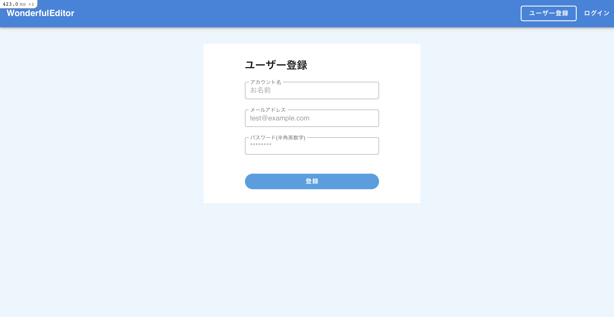

# READEME

## タイトル
**WonderfulEditor**

## 概要
wonderful_editorは記事を作成するサービスです。アカウントを作成すれば、下書き機能やマイページ機能も使用できます。

## 動作環境
・Ruby: 2.7.2

・Rails: 6.0.3.7

・Vue.js: 2.6.11

・DB: PostgreSQL

## 機能
・記事一覧機能

・マイページ機能（自分が書いたか記事を見ることができる）

・ユーザー登録

・サインイン/サインアウト

・記事CRUD機能

・記事の下書き機能

下記URLにて機能動画が閲覧できます。

https://watch.screencastify.com/v/XOV26xZb8bPmnrVwo3Ss
